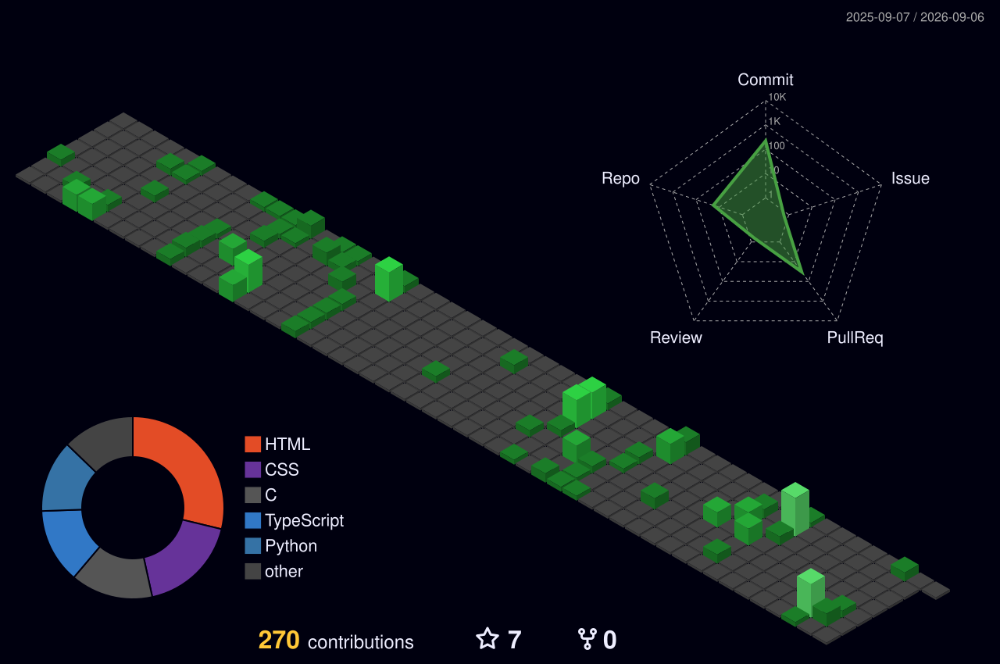

## Tech Stack

###  Languages

###  Development

###  Infrastructure & Virtualization

###  Backend & Database

### 🌐 Deployment

##  Currently

  Working through the [42 Common Core](https://github.com/0xARCOS) curriculum — systems programming, algorithms, Unix.
  
  Building AI-integrated products for real clients (therapy tools, automation workflows).

##  Activity

