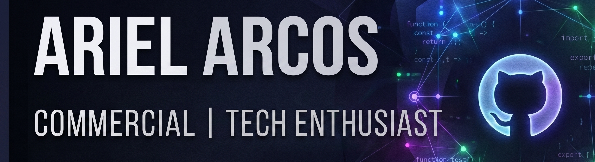

  

---

## 🛠️ Tech Stack

### 💻 Languages

### 🚀 Development Tools

### 📦 Backend & Database

### 🌐 Deployment

## Currently

- Working through the [42 Common Core](https://github.com/0xARCOS) curriculum — systems programming, algorithms, Unix
- Building AI-integrated products for real clients (therapy tools, automation workflows)
- Deepening Python: OOP, design patterns, clean architecture

  

---

[LinkedIn](https://www.linkedin.com/in/ariel-arcos-3731a5254/)
